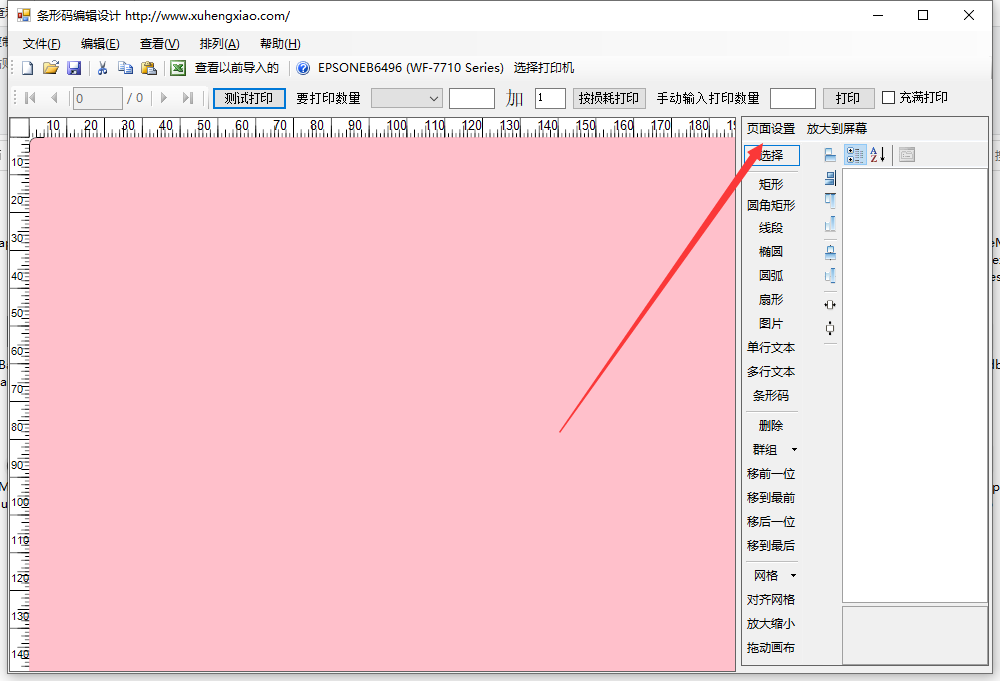
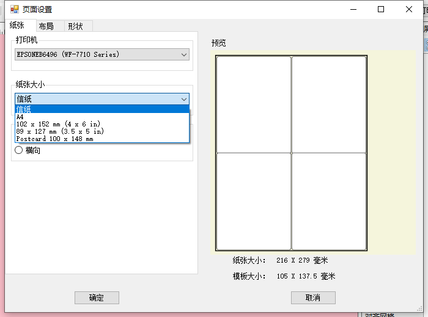
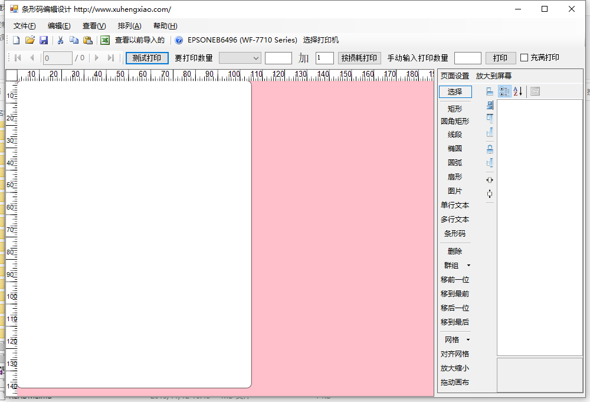
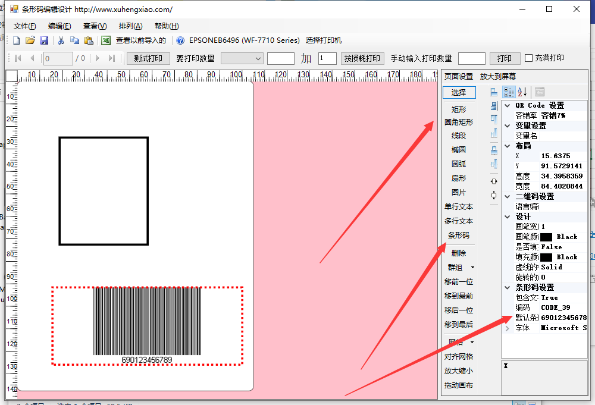
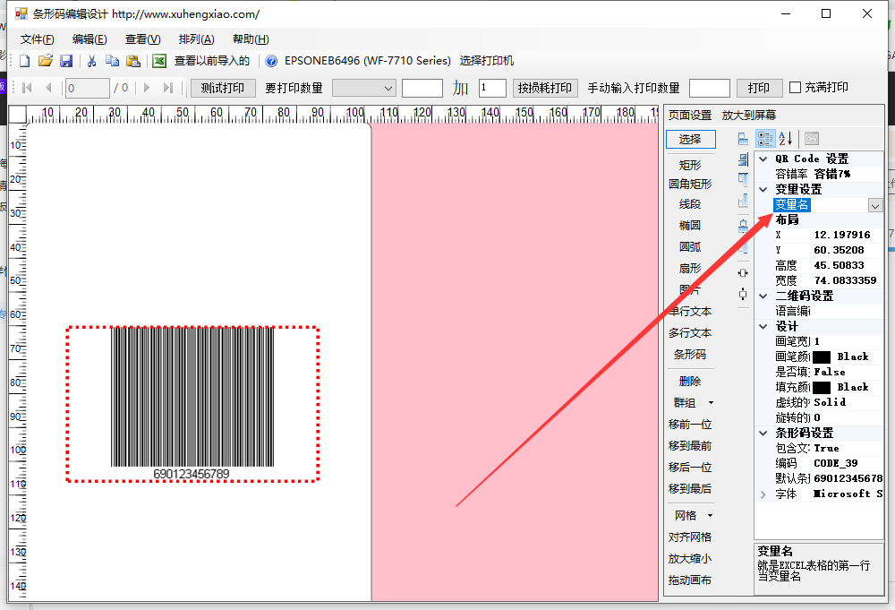
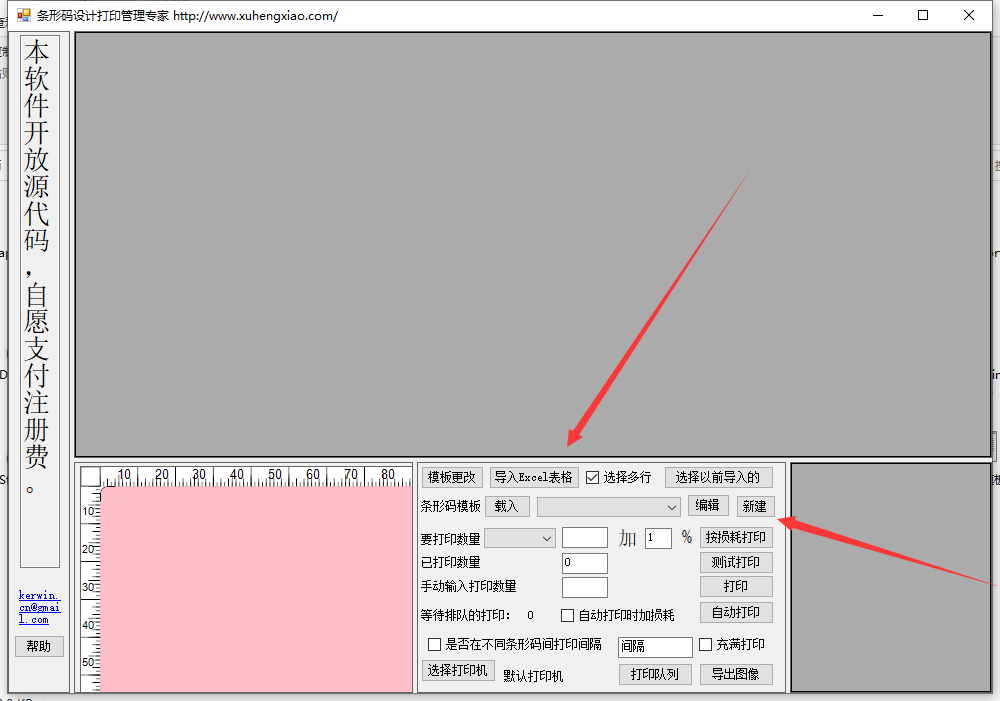

# barcodeManager

本软件可以实现根据模板批量打印条形码，条形码的数字，或者其他文本等，都可以做一个模板，然后具体的内容由EXCEL表格提供。  

本软件分2个重要的组成部分，下载软件后，可以看到一个是条形码模板的编辑，一个是条形码管理专家。下面做一下介绍  

## 条形码模板编辑

打开软件后，因为条形码纸张尺寸不同，首先应该设置的是纸张尺寸，如下：  
  
打开页面设置后，会出现如下的界面  

  

不同的打印机有不同的纸张尺寸，请选择相关的打印机和相关的纸张尺寸，这里清注意，比如有一些A4纸大小的条形码纸张，还分成很多行列的，在这里，需要选择A4纸大小，然后行列数，请在“布局”中设置，对打印机而言，这个纸张尺寸就是A4大小，但对于我们想分隔成很多行列的，我们可以自己在这里设置。设置好纸张后，点击确定，到如下界面：  

  

可以看到上边有一块白色的地方，这个就是模板，在这上边画图形，还有请注意，比如上边选择的是2行2列的布局，这里的一块白色的，是其中一块的布局模板，如果2行2列的模板都不相同，那么在页面中，还是选择1行1列吧。  

如下是绘制了一些简单的图形  
  

对于条形码而言，我们的条形码一般是自动更改的，这里要设置如下  
  

要设置这个变量名，这个变量名就是excel表格中的列名，比如如下的表格，我这里的列名就要设置成“条形码”，这样子，从excel表格中读取书的时候，条形码列中的条形码具体信息就会填充到条形码中，其他的，单行文本和多行文本同理。如下的款号、品名和数量，都可以设置成文本，然后打印的时候，会自动的根据具体的内容打印。  

|款号 | 品名 |  数量  |   条形码  |
|-----|-----|--------|----------| 
|1 |   男装T恤  |  342 |   123456789012 |  
|2 |   女装T恤  |  42342 |   123456789013 |  
|3 |   男装休闲长裤 |   4242 |   123456789014 |  
|4 |   女装休闲长裤 |   42  |  123456789015 | 
|5 |   男装牛仔长裤  |  4242  |   123456789016 | 
|6 |   女装牛仔长裤  |  42  |  123456789017 | 
|7 |   男装长袖衬衫  |  452 |   123456789018 | 
|8 |   女装长袖衬衫   | 5432  |  123456789019 | 

 

## 表形码管理专家

在这个管理专家中，我们可以快速的选择条形码模板，快速的选择excel表格，实现快速的打印。  

  

# 支援作者
撸码不易，请支援作者继续开发  
  
